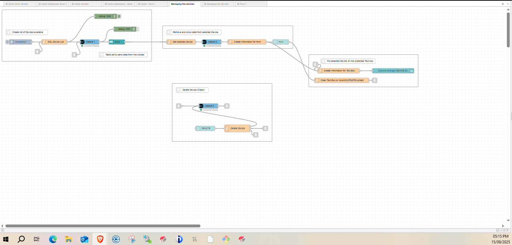
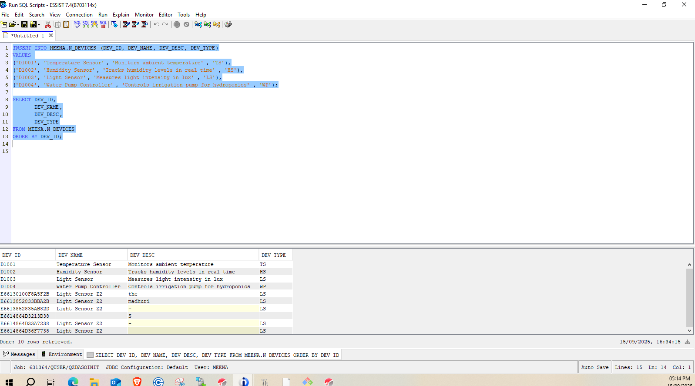
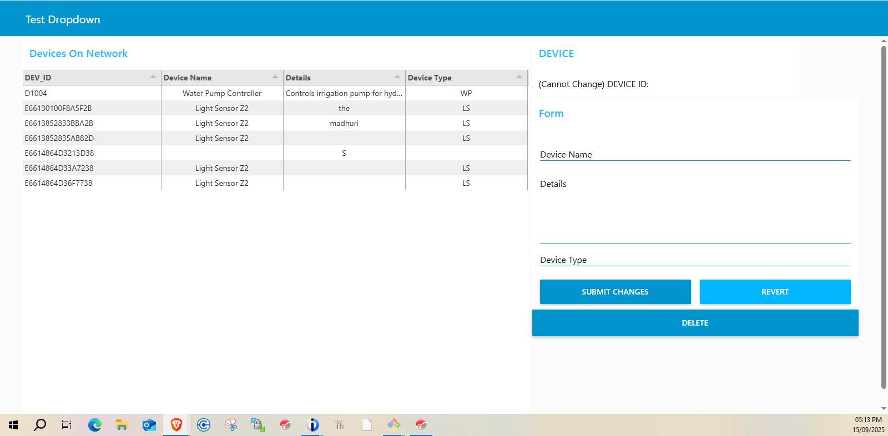

# Node-RED Device Management Dashboard

<p align="center">
  
  &nbsp;&nbsp;&nbsp;
  
</p>

This project demonstrates how to manage devices using **Node-RED** integrated with **IBM i (DB2 for i)**.  
The devices in this dashboard are **inserted into the IBM i database** and managed through Node-RED flows, rather than being connected physical devices.  

It provides a practical example of how enterprise systems can be connected with low-code dashboards for **real-time CRUD operations** (Create, Read, Update, Delete).

---

## 🚀 Features
- View devices stored in **DB2 for i**  
- Update device details through a web form  
- Delete devices with protected Device ID handling  
- Refresh device list automatically after updates or deletes  
- Node-RED Dashboard for easy, user-friendly management  

---

## 📊 Dashboard Preview


---

## 🛠️ How It Works
1. Devices are inserted into the **IBM i (DB2 for i)** table `N_DEVICES`.
2. Node-RED queries the database and displays the results in a dashboard table.
3. Selecting a row opens a form to edit device details (name, type, description).
4. Updates and deletes are written back to DB2 instantly, and the table refreshes.

---

## 📂 Files in This Repository
- `device-management.json` → Node-RED flow to import  
- `README.md` → Project documentation  
- `node.PNG`, `ibm.PNG` → Logos used in README  
- `dashboard.PNG` → Screenshot of the dashboard  

---

## ⚡ Usage
1. Clone this repository:  
   ```bash
   git clone https://github.com/meena108/node-red-device-management.git
   cd node-red-device-management
